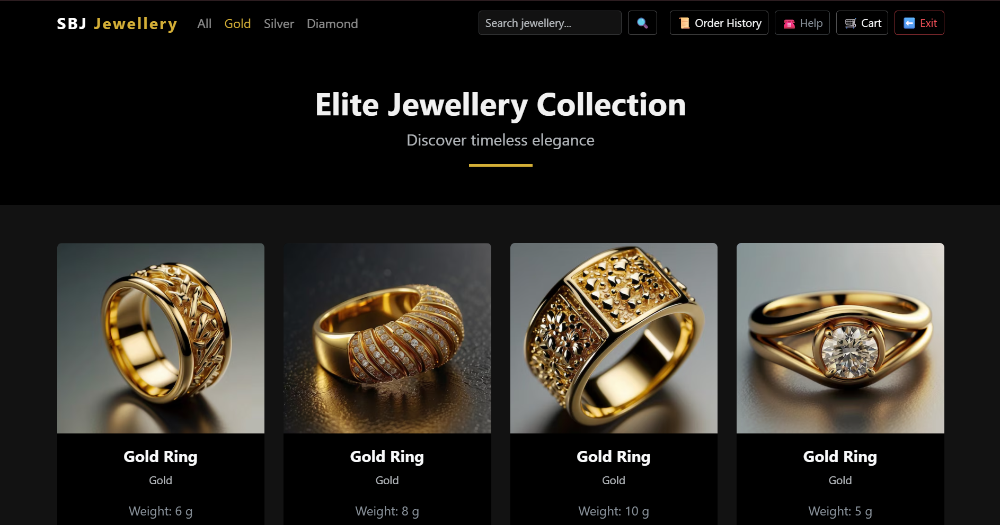
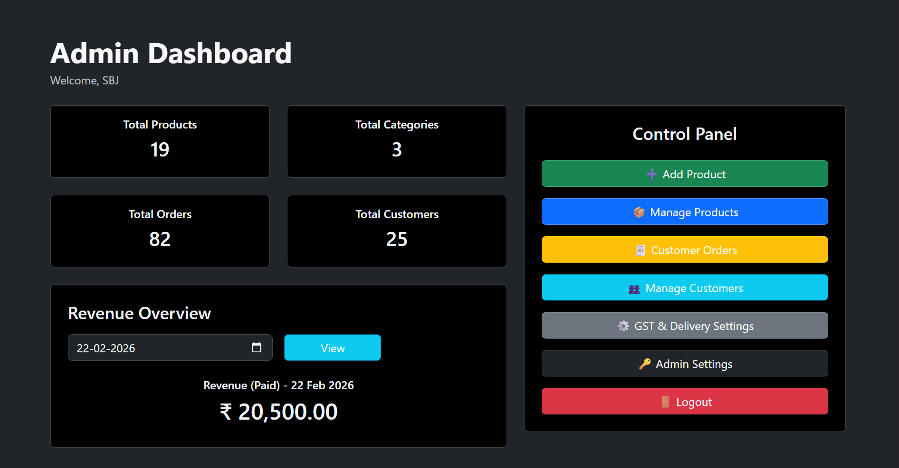
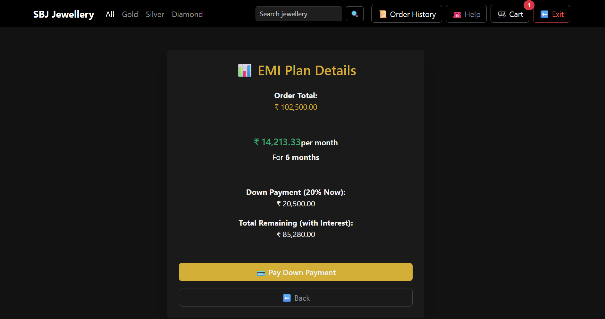
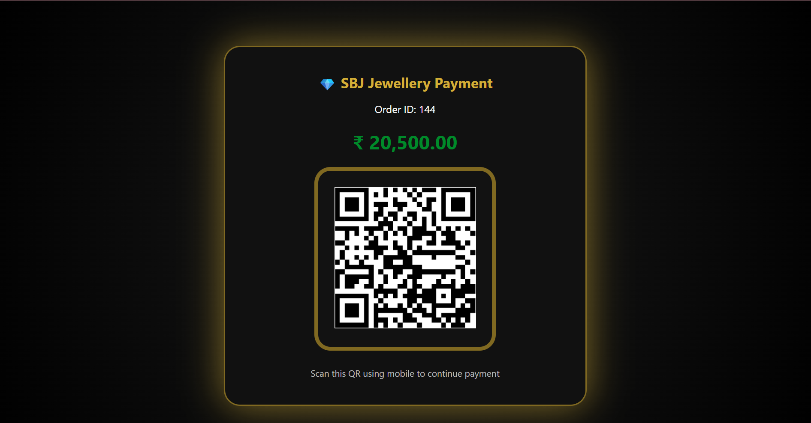
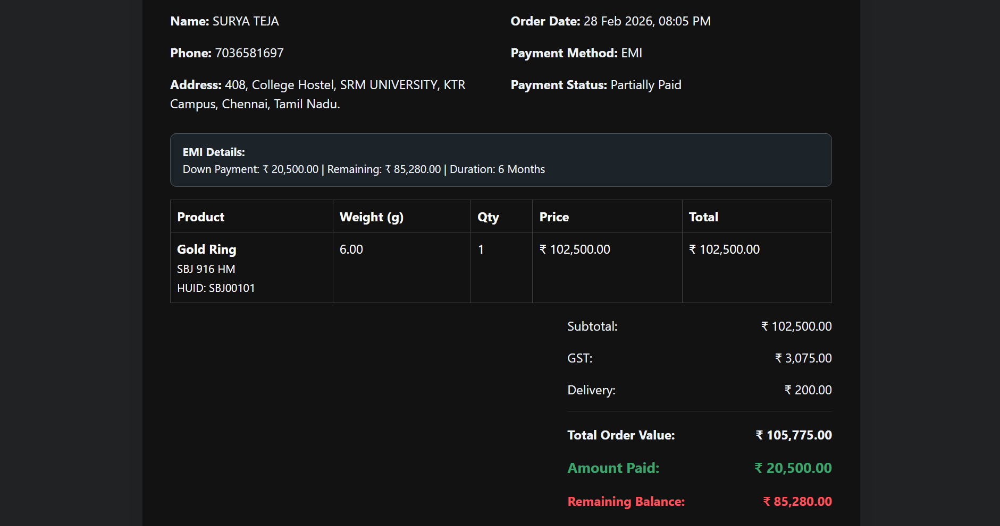
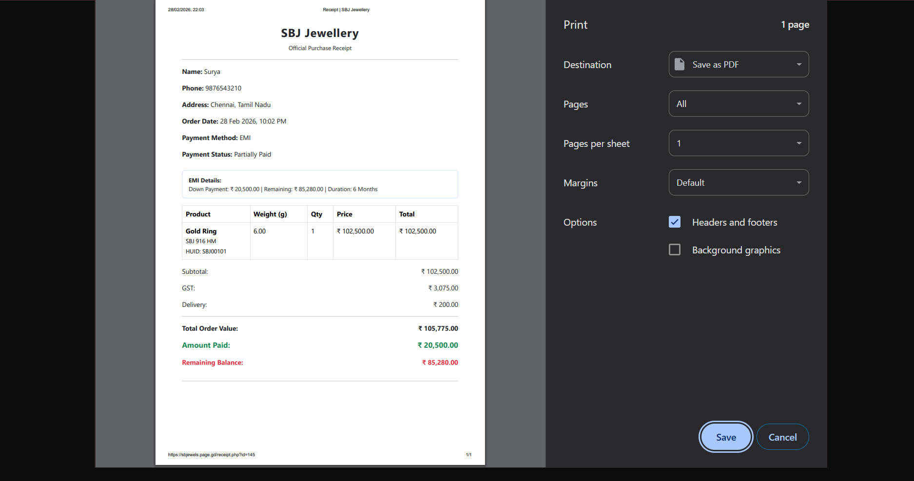

# Jewellery Inventory and Sales Management System

A structured web-based application designed to manage jewellery inventory, customer orders, payment workflow, and HUID validation with an integrated admin dashboard.

---

## 📌 Overview

This system simulates a real-world jewellery store backend workflow.  
It focuses on structured database relationships, validation rules, and accurate order lifecycle tracking.

The project demonstrates practical backend logic, relational database implementation, and controlled state transitions.

---

## ⚙️ Core Features

- Product & category management
- 916 / 999 gold purity validation
- Unique HUID generation & tracking
- Cart and checkout workflow
- QR / EMI / COD payment handling
- Order lifecycle management  
  *(Placed → Packed → Shipped → Delivered)*
- Admin dashboard with order & revenue monitoring

---

## 🗂 Database Modules

- Admin  
- Categories  
- Products  
- Customers  
- Orders  
- Order Items  
- Payments  
- Delivered Items  

Relational integrity and structured workflow logic are maintained across modules.
---

## 🛠 Tech Stack

- PHP  
- MySQL  
- HTML5  
- CSS3  
- Bootstrap  
- JavaScript  
- Git & GitHub  

---

## 📸 Screenshots

### Homepage

### Admin Dashboard

### EMI Plan

### QR Payment

### Receipt View

### Receipt Print

---

## 🎯 Project Objective

To design and implement a structured inventory and sales management system that reflects practical backend workflow, database normalization, and real-world order processing logic.

---

Developed independently as a system-focused backend implementation project.
